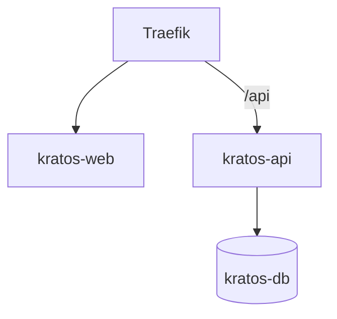

# Kratos

Workout application delivered as a progressive web app, backed by its own
Postgres database and a FastAPI service.

One codebase, installs to the home screen on both iOS and Android.

## Services

| Service | Port | Purpose |
|:---|:---|:---|
| `kratos-web` | 8080 | Built PWA client served by nginx, SPA fallback |
| `kratos-api` | 8000 | FastAPI service over SQLAlchemy 2.0 |
| `kratos-db` | 5432 | PostgreSQL 16, data on a host bind mount |



Both application services sit behind Traefik on the external `aether-net`
network and are published at `kratos.${DOMAIN_NAME}`.

## Status

Bootstrap. The repository holds the decided stack and a working skeleton of the
v1 domain — catalogue, plan, and log — with the specified database schema applied
through a migration. Features are added from here.

## Layout

```
api/      FastAPI service, SQLAlchemy 2.0 models, Alembic migrations
web/      React + TypeScript + Vite PWA client
scripts/  Shared deploy scripts (ops-scripts submodule)
```

## Domain

Three groups, in the order data arrives:

| Group | Tables | Question it answers |
|:---|:---|:---|
| Catalogue | `exercise` | What can be performed? |
| Plan | `routine`, `routine_item` | What do I intend to do? |
| Log | `session`, `session_item`, `set_entry` | What did I actually do? |

Derived values — volume, estimated 1RM, last performance — are database views
(`v_set`, `v_e1rm`, `v_session_volume`, `v_exercise_last`), never stored columns.
The Alembic migration `0001_v1_schema` is the schema of record.

## Running the API

```bash
docker compose -f docker-compose.dev.yml up -d db
cd api
cp ../.env.example .env
python -m venv .venv && . .venv/bin/activate
pip install -r requirements-dev.txt
alembic upgrade head
uvicorn app.main:app --reload
```

OpenAPI is served at `/docs`; the schema at `/openapi.json`. Every route declares
a response model, so `/openapi.json` stays a usable contract.

## Running the web client

```bash
cd web
npm install
npm run dev
```

The dev server proxies `/api` to `http://localhost:8000`.

## Tests

The API tests need a real Postgres, because the value of this schema is in its
views and its constraints — a SQLite substitute would verify neither.

```bash
cd api
pytest
```

The suite starts a throwaway Postgres server and applies the migrations to it, so
no service needs to be running first. Point it at an existing instance instead
with `KRATOS_TEST_DATABASE_URL`.

## Configuration

Environment variables carry the `KRATOS_` prefix — see `.env.example`.

## Deploy

Pushing to `main` deploys to the Gaia swarm. To deploy by hand:

```bash
./setup_host.sh
./scripts/deploy.sh "kratos" docker-compose.yml
```

## Documentation

Full documentation lives in the vault:
`Areas/90-Infrastructure/Kratos/Kratos Stack.md` — architecture, routing, the
database password rationale, host-directory procedure, the fleet-wide label
convention, troubleshooting, and pitfalls.
